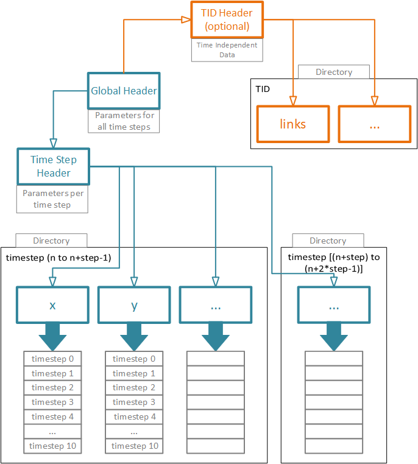
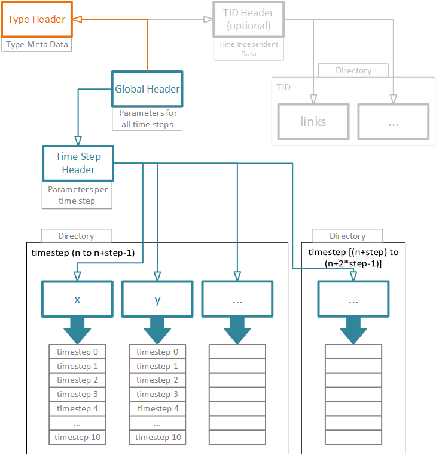
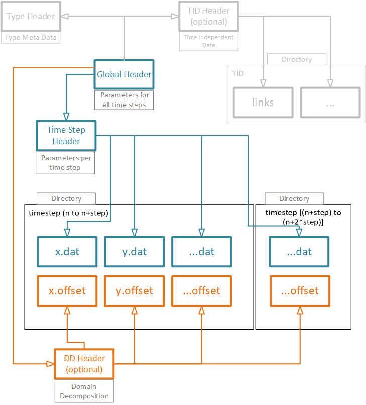

# File Format Specification NGPF
Version: 0.1-beta  
VISUS, University of Stuttgart  
Oliver Fernandes, Patrick Gralka, Tobias Rau, Guido Reina, Michael Krone

## Sections
[Preface](#preface)  
[General Conventions](#general-conventions)  
[Naming Conventions](#naming-conventions)  
[Supported Binary Codecs](#binary-codecs)  
[Supported Data Types](#data-types)  
[Global Header](#global-header)  
[Time Step Header](#time-step-header)  
[Data](#data)  
[Time Independent Data](#time-independent-data)  
[Type File](#type-file)  
[Domain Decomposition](#domain-decomposition)  
[Examples](#examples)

## Preface 
The NGPF file format focuses on easy *readability of meta data* and *large particle-based* data sets from computational physics, chemistry, biology and more.
The NGPF file format offers human-readable [JSON] headers and a separation of global and per-time-step *parameters*.
Therefore, changes of a *parameter*, such as bounding-box size, can be applied without the need for re-conversion or re-processing of the entire data set.
A user can refer to the header files for a quick overview of relevant *parameters*.
The actual data is stored in a *binary format*.
A user can choose between a variety of *binary codecs* (compression methods) to encode the data (including RAW, i.e. unencoded).
The components of the NGPF file format and their interactions are shown in the schematic below.
A *Global Header* stores the *parameters* relating to all time steps, such as *version number* or the *number of time steps*.
The *Time Step Header* contains the *parameters* of each individual time step (e.g. *number of particles*, *time stamp*).
An optional *Type File* can be used to assign chemical elements to particles, set a per-type color or radius, or describe rigid molecules (no inner DOF) via multiple sites/centers per particle (which should then be interpreted as instances of the rigid molecules).
Additionally, the Type File can contain *parameters* about the element/molecule, such as atomic mass, charge, etc.

  
Figure: Schematic of the file format header management.

## General Conventions
[Go to Top](#top)  

In the following we define some terms that will be used throughout this document.
*Parameters* are properties of a data set (or the simulation that generated it) and thus are stored in the header files.
*Attributes* are properties of particles and are stored in the data files.
A *time step* represents a monotonically increasing iteration step of a simulation.
It can be complemented by a real-time *time stamp* relative to the simulation start time.
The term `float` corresponds to an IEEE-754 standard floating point value with a size of 32 bit.
A `byte` is an integer with the size of 8 bit.
The NGPF headers use `JSON` notation with a `utf-8` encoding and a byte order mark (UTF-8 BOM).
The NGPF headers will handle a `string` as an ASCII and a `unicode` as a unicode (UTF-8) string.
A string that represents a file path always uses forward slashes `/` to separate directories.
Additionally, all paths are interpreted relative to the directory where the global header is stored.
Paths beginning with `/` are not allowed.
Paths must not contain `../` at all.
The `Version` of the NGPF file format consists of three integer values and a commit hash separated by a dot (`int64.int64.int64.hash`).
The first integer corresponds to the major format version (not necessarily compatible to previous versions).
The second integer is incremented at feature releases (retaining compatibility), and the last integer is incremented at smaller changes and bug fixes.
Integers: `(u)int64`, `(u)int32` and floats `float`, `double` values also support the scientific number format (e.g. `1e2` for integers and floats or `1.0e2(.0)` only for floats). 
  
## Naming Conventions
[Go to Top](#top)  
The file format supports several pre-defined *attribute* names for convenience:

| Attribute | Description |
| :-- | :-- |
| `type` | Type (see [Type Header](#type-header)) |
| `id` | Particle ID |
| `x, y, z` | Position |
| `vx, vy, vz` | Velocity |
| `r, g, b` | Color |
| `rad` | Radius |
| `qr, qi, qj, qk` | Quaternion |

Attribute bricking (e.g. `"x y z"`) is only allowed if the involved attributes are of the same type.
For the type `byte` only a composition of four `byte` attributes is allowed (often used for `"r g b a"`).

## Supported Data Types
[Go to Top](#top)  

| Type | Description |
| :-- | :-- |
| `(u)int64` | 64-bit (unsigned) integer |
| `(u)int32` | 32-bit (unsigned) integer |
| `byte` | 8-bit unsigned integer (e.g. `uint8_t`) |
| `double` | IEEE-754 standard 64-bit floating point value |
| `float` | IEEE-754 standard 32-bit floating point value |
| `string` | ASCII string value |
| `unicode` | UTF-8 string value |

## Supported Binary Codecs
[Go to Top](#top)  

| Codec | Description |
| :-- | :-- |
| RAW | Raw storage of data |
| ZFP | Floating-point compression scheme [ZFP] |
| RLE | Run-length encoding |
| DE | Run-length encoding of *delta encoded* data |

## Global Header
[Go to Top](#top)  

Parameters accepted by the NGPF Global Header.  

| Parameter | Format | Description |
| :-- | :-- | :-- |
| `Identifier` | `string` | Identifies the file as NGPF global header (fixed value`"NGPF"`) |
| `Version` | `"int64.int64.int64.hash"` | NGPF version number |
| `TimeSteps` | `int64` | Number of time steps |
| `SimulationTimeUnit` | `string` | Unit of the `SimulationTime`, e.g. `nanoseconds`, `custom` |
| `MaxSimulationBox` | `[(min) double, (min) double, (min) double, (max) double, ...]` | Union of simulation boxes over all time steps of the data set |
| `TimeStepHeader` | `string` | Relative path to the time step header (see [Time Step Header](#time-step-header)) |
| `TimeStepDirectoryPrefix` | `string` | Sets the naming scheme for the time step directories (as C format string) |
| `TimeStepDirectoryIncrement` | `int64` | Defines how many time steps are stored in one directory |
| `TimeStepAttributeExtension` | `string` | Defines the file extension of the attribute files inside the time step directories |
| `TimeStepLayoutColumnName` | `[string, string, ...]` | Name of each column |
| `TimeStepLayoutColumnType` | `[string, string, ...]` | Name of the column type (e.g. `float, int`) |
| `TIDHeader` | `string` | (O)Relative path to the time independent data header (see [Time Independent Data](#time-independent-data)) |
| `TypeHeader` | `string` | (O)Relative path to the type header (see [Type File](#type-header)) |
| `DDHeader` | `string` | (O)Relative path to the domain decomposition header (see [Domain Decomposition Header](#domain-decomposition-header)) |
| `DDOffsetExtension` | `string` | (O)Extension of the offset attribute file |

## Time Step Header
[Go to Top](#top)  

Parameters accepted by the NGPF Time Step Header.  

| Parameter | Format | Description |
| :-- | :-- | :-- |
| `TimeStep` | `int64` | ID of the time step, usually the first time step has id 0 |
| `Particles` | `int64` | Number of particles |
| `SimulationTime` | `double` | Corresponding time to the time step |
| `SimulationBox` | `[(min) double, (min) double, (min) double, (max) double, ...]` | Simulation box of the time step |
| `ParameterOffsets` | `[int64, int64, ...]` | Offset inside the data file to the corresponding time step for each attribute. |
| `Codecs` | `[struct, struct, ...]` | Defines a struct for each attribute. A struct contains the codec name and the codec properties. |

## Data
[Go to Top](#top)  

Each time step range is in a separate directory.
Inside these directories, the data is split into a individual file for each *attribute* or *attribute* combination.
For example in the `x.dat` file, which is located in the `timestep0` directory, the data of *attribute* `x` for time steps `0-9` is stored.
The stored data is compressed by a codec specified by the user.
Additionally, this codec can vary for each time step and each *attribute*.
If more than one *attribute* is stored in a file (e.g. `x y z`), each *attribute* must be stored in separate blocks (i.e. interleaved storage is not allowed).
For combined *attributes*, a specified codec applies to all *attributes*. All data that is written to the hard disk is *little endian* encoded. `RAW` data is left as is.

directory for time step 0 to time step 9  

| x.dat | y.dat | z.dat | r.dat | g.dat | b.dat |
|:--|:--|:--|:--|:--|:--|
| ZFP0(x_timestep0) | ZFP0(y_timestep0) | ZFP0(z_timestep0) | RAW0(r_timestep0) | RAW0(g_timestep0) | RAW0(b_timestep0) |
| ZFP1(x_timestep1) | ZFP1(y_timestep1) | ZFP1(z_timestep1) | RAW1(r_timestep1) | RAW1(g_timestep1) | RAW1(b_timestep1) |
| ZFP2(x_timestep2) | ZFP2(y_timestep2) | ZFP2(z_timestep2) | RAW2(r_timestep2) | RAW2(g_timestep2) | RAW2(b_timestep2) |
| ... | ... | ... | ... | ... | ... |

directory for time step 10 to time step 19  

| x.dat | y.dat | z.dat | r.dat | g.dat | b.dat |
|:--|:--|:--|:--|:--|:--|
| ZFP10(x_timestep10) | ZFP10(y_timestep10) | ZFP10(z_timestep10) | RAW10(r_timestep10) | RAW10(g_timestep10) | RAW10(b_timestep10) |
| ZFP11(x_timestep11) | ZFP11(y_timestep11) | ZFP11(z_timestep11) | RAW11(r_timestep11) | RAW11(g_timestep11) | RAW11(b_timestep11) |
| ZFP12(x_timestep12) | ZFP12(y_timestep12) | ZFP12(z_timestep12) | RAW12(r_timestep12) | RAW12(g_timestep12) | RAW12(b_timestep12) |
| ... | ... | ... | ... | ... | ... |

## Time Independent Data (optional)

An attribute that is marked as *time independent data* is constant for the whole simulation, e.g. links between particles.
The *TID header* defines the following parameters.

| Parameter | Format | Description |
|:--|:--|:--|
| TIDDirectory | `string` | Directory for the storage of TID data |
| TIDAttributes | `[string, string, ...]` | Names of the TID attributes |
| TIDTypes | `[string, string, ...]` | Types of the TID attributes |
| TIDCodecs | `[struct, struct, ...]` | Codecs and properties of the codecs |

  
Figure: Schematic with included time independent data.

## Type File (optional)
[Go to Top](#top)  
Particles can be identified by a type ID.
The properties of a type are specified in the type file.
NGPF supports a hierarchical structure to reconstruct complex particle combinations or rigid molecules.
However, only the `Name` and the `TypeID` is required to identify particles.
A user can also define *parameters* of any shape to a `TypeID` using the `CustomParameter`.
The `CustomParameter` is defined at the beginning of the type file and takes an array of structs.
In a single struct the `Name` and the `Type` of a custom parameter should be defined.

Arguments the `CustomParameter` struct takes.  

| Parameter | Format | Description |
| :-- | :-- | :-- |
| `Name` | `unicode` | Name of the custom parameter |
| `Type` | `string or [string, ...]` | Defines the type and the Format of the custom parameter |

Parameters accepted by the NGPF Type File.  

| Parameter | Format | Flag | Description |
| :-- | :-- | :-- | :-- |
| `TypeID` | `int64` | Required | Particle type ID |
| `Name` | `string` | Required | Name of the particle type (e.g. `H`) |
| `NumberSites` | `int64` | Supported | Number of sites of the e.g. molecule |
| `Color` | `[int64, int64, int64, int64]` | Supported | Color of this type |
| `Radius` | `double` | Supported | Radius of this type |
| `Centers` | `[[double, double, double], [...], ...]` | Supported, Multisite | Centers of the sites relative to the center of mass |
| `Types` | `[int64, int64, ...]` | Supported, Multisite | Type IDs of the sites |
| `Quaternion` | `[[double, double, double, double], [...], ...]` | Supported, Multisite | Quaternions of connected sites. Can also be empty if a site is, e.g., a single atom. |

  
Figure: Schematic with included type file.

## Domain Decomposition
[Go to Top](#top)  

In a decomposed simulation, each rank is in charge of one domain.
The most efficient way of writing data is when each rank writes its own data to the storage device.
The optional *Domain Decomposition Header* stores the *parameters* of the domains.
Because every rank writes its own data, each rank also encodes its own piece of the data.
Subsequently, the decoder needs to know the *offsets to each piece* to be able to reconstruct the data as intended.
For this purpose, an additional *offset data file* will be generated for each *attribute*.
The offsets are a number of bytes and the offset data file will be dumped to the disk in a RAW encoded binary. The `DDOccupation` and the `DDGeometry` are synchronized arrays, the indices of those arrays should match the domain ID.

Parameters accepted by the NGPF Domain Decomposition Header.  

| Parameter | Format | Description |
| :-- | :-- | :-- |
| `TimeStepID` | `int64` | ID of the time step |
| `Domains` | `int64` | Number of total domains for this time step |
| `DDOccupation` | `[int64, int64, ...]` | Number of particles in each domain. |
| `DDType` | `string` | Type of the domain decomposition, e.g. `box`, `BSP` (Binary Space Partitioning). |
| `DDGeometry` | `[[double, ...], [double, ...], ...]` | Coordinates of the decomposed regions |

### BSP (Binary Space Partitioning)

BSP is a hierarchical structure that contains a normal `[nx, ny, nz]` and a distance `d` to describe a plane (Hesse normal form). 

	BSP0: [[nx, ny, nz], d]

The children of `BSP0` are `BSP1` and `BSP2`. This follows the rule

	children(n_i) = n_(2i+1), n_(2i+2)

If the hierarchical structure stops at some point, the missing structure is filled with empty brackets `[]`.

  
Figure: Schematic with included domain decomposition.

## Examples
[Go to Top](#top)  

### Global Header

	{
	Identifier: "NGPF",
	Version: "1.0.0.3fa5735-dirty",
	TimeSteps: 100,
	SimulationTimeUnit: "nanoseconds",
	MaxSimulationBox: [-1.0, -1.0, -1.0, 1.0, 1.0, 1.0],
	TimeStepHeader: "timestepheader.json",
	TimeStepDirectoryPrefix: "timestep%.3i",
	TimeStepDirectoryIncrement: 10,
	TimeStepAttributeExtension: "dat",
	TimeStepLayoutColumnCount: 6,
	TimeStepLayoutColumnName: ["type", "id", "x", "y", "z", "r", "g", "b"],
	TimeStepLayoutColumnType: ["byte", "uint32", "float", "float", "float", "byte", "byte", "byte"],
	TIDHeader: "tidheader.json",
	TypeHeader: "typeheader.json",
	DDHeader: "ddheader.json",
	DDOffsetExtension: "offset"
	}

The *parameter* `TimeStepDirectoryPrefix: "timestep%0.3i"` fixes the time step directory affix to a three digit integer.
This results in the directory names `timestep000`, `timestep010`, `timestep020`, ...
### Time Step Header

	{
	TimeStepID: 0,
	SimulationTime: 0.0,
	Particles: 1000,
	SimulationBox: [-1.0, -1.0, -1.0, 1.0, 1.0, 1.0],
	ParameterOffsets: [0, 0, 0, 0, 0, 0, 0, 0]],
	Codecs:	[
		{Name: "RAW"},
		{Name: "DE"},
		{Name: "ZFP",
	 	 Epsilon: 0.1},
		{Name: "ZFP",
		 Epsilon: 0.1},
		{Name: "ZFP",
	 	 Epsilon: 0.1},
		{Name: "RAW"},
		{Name: "RAW"},
		{Name: "RAW"}
		]
	}{
	TimeStepID: 1,
	SimulationTime: 0.1,
	Particles: 1000,
	SimulationBox: [-1.0, -1.0, -1.0, 1.0, 1.0, 1.0],
	ParameterOffset: [8000, 32000, 32000, 32000, 32000, 8000, 8000, 8000]],
	Codecs:	[
		{Name: "RAW"},
		{Name: "DE"},
		{Name: "ZFP",
	 	 Epsilon: 0.1},
		{Name: "ZFP",
		 Epsilon: 0.1},
		{Name: "ZFP",
	 	 Epsilon: 0.1},
		{Name: "RAW"},
		{Name: "RAW"},
		{Name: "RAW"}
		]
	}

### Time Independent Header (optional)

	{
	TIDDirectory: "ti_data",
	TIDAttributes: ["links_fw", "links_bw"],
	TIDTypes: ["uint_32", "uint_32"],
	TIDCodecs: [{Name: "DE"}, {Name: "DE"}]
	}

### Type File (optional)

    {
    CustomParameters: [{Name: "rho",
                        Type: "double"},
	                   {Name: "charge",
	                    Type: "int64"}]
		{
		TypeID: 0,
		Name: "H",
		NumberSites: 1
		Color: [r, g, b, a],
		Radius: 1.2,
		}{
		TypeID: 1,
		Name: "O",
		NumberSites: 1
		Color: [r, g, b, a],
		Radius: 2.2,
		}{
		TypeID: 2,
		Name: "C",
		NumberSites: 1
		Color: [r, g, b, a],
		Radius: 2.4,
		}{
		TypeID: 3,
		Name: "OH",
		NumberSites: 2,
		Centers: [[x1, y1, z1], [x2, y2, z2]],
		Types: [1, 0]
		}{
		TypeID: 4,
		Name: "Methanol",
		Color: [r, g, b, a],
		NumberSites: 5,
		Types: [0, 0, 0, 2, 3],
		Centers: [[x1, y1, z1], [x2, y2, z2], [x3, y3, z3], [x4, y4, z4], [x5, y5, z5]],
		Quaternion: [[], [], [], [], [qr, qi, qj ,qk]]
		}{
    	TypeID: 5,
    	Name: "Hugo",
    	rho: 1.2,
		charge: -1
    	}
    }

### Domain Decomposition Header (optional)

	{
	TimeStepID: 0,
	Domains: 8,
	DDOccupation: [131, 119, 52, 195, 147, 110, 144, 102],
	DDType: "box",
	DDGeometry: [[-1.0, -1.0, -1.0, 0.0, 0.0, 0.0],
		     [-1.0, -1.0,  0.0, 0.0, 0.0, 1.0],
		     [-1.0,  0.0, -1.0, 0.0, 1.0, 0.0],
		     [-1.0,  0.0,  0.0, 0.0, 1.0, 1.0],
		     [ 0.0, -1.0, -1.0, 1.0, 0.0, 0.0],
		     [ 0.0, -1.0,  0.0, 1.0, 0.0, 1.0],
		     [ 0.0,  0.0, -1.0, 1.0, 1.0, 0.0],
		     [ 0.0,  0.0,  0.0, 1.0, 1.0, 1.0]]
	}

[ZFP]: (https://github.com/Unidata/compression/tree/master/zfp)
[JSON]: (http://www.json.org)

