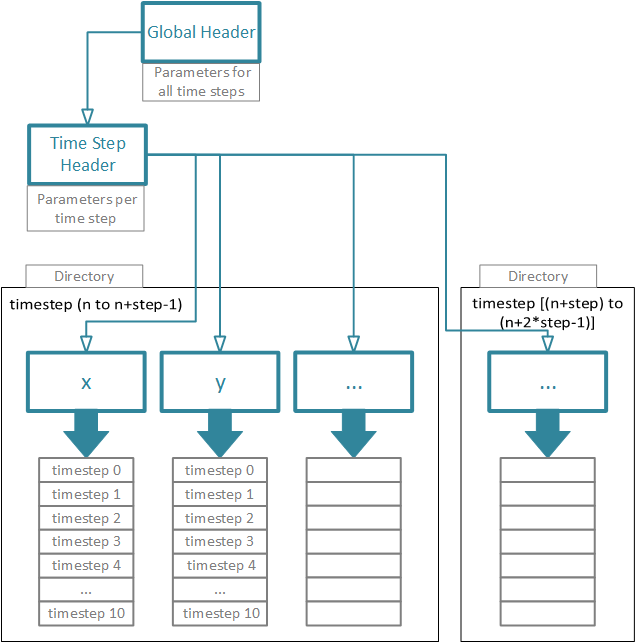

# File Format Specification NGPF
Version: 1.0  
VISUS University of Stuttgart  
Oliver Fernandes, Patrick Gralka, Tobias Rau

## Sections
[Preface](#preface) 
[File format](#file-format)  
[Global header](#global-header)  
[Frame header](#frame-header)  
[Frame data](#frame-data)  
[Type file](#type-file)  
[Example](#example)

## Preface 
The NGPF file format offers human-readable [JSON] headers and a separation of global and per-frame parameters. The user can use the header files for quick reference of the relevant parameters. The actual data is stored in a binary format that is chosen by the user. The ngpf library offers a variety of binary codecs (link to ngpf library). An optional type header can be used to assign particles to chemical elements or also molecules. Additionally, the type header can containt meta information about the element/molecule, e.g. charge, quaternions.

  

Figure: Schematic of the file format header management.

  

## Global header
[Go to Top](#top)  

<table style="width:97%;">
<caption> Parameters accepted by the NGPF global header.</caption>
<colgroup>
<col width="24%" />
<col width="23%" />
<col width="50%" />
</colgroup>
<thead>
<tr class="header">
<th align="left">Parameter</th>
<th align="left">Format</th>
<th align="left">Description</th>
</tr>
</thead>
<tbody>
<tr class="odd">
<td align="left"><code>Identifier</code></td>
<td align="left"><code>string</code></td>
<td align="left">identifies the file as NGPF global header</td>
</tr>
<tr class="even">
<td align="left"><code>Version</code></td>
<td align="left"><code>"int.int.int"</code></td>
<td align="left">NGPF version number</td>
</tr>
<tr class="odd">
<td align="left"><code>Frames</code></td>
<td align="left"><code>int</code></td>
<td align="left">number of frames</td>
</tr>
<tr class="even">
<td align="left"><code>MaxBoundingBox</code></td>
<td align="left"><code>[float, float, float]</code></td>
<td align="left">maximum bounding box of the data set</td>
</tr>
<tr class="odd">
<td align="left"><code>MaxClippingBox</code></td>
<td align="left"><code>[float, float, float]</code></td>
<td align="left">maximum clipping box of the data set</td>
</tr>
<tr class="even">
<td align="left"><code>MaxSimulationBox</code></td>
<td align="left"><code>[float, float, float]</code></td>
<td align="left">maximum simulation box of the data set</td>
</tr>
<tr class="odd">
<td align="left"><code>FrameHeader</code></td>
<td align="left"><code>string</code></td>
<td align="left">Relative path to the frame header (see <a href="#frame-header">Frame header</a>) </td>
</tr>
<tr class="even">
<td align="left"><code>TypeHeader</code></td>
<td align="left"><code>string</code></td>
<td align="left">Relative path to the frame header (see <a href="#type-header">Type header</a>)</td>
</tr>
<tr class="odd">
<td align="left"><code>FrameLayoutColumnCount</code></td>
<td align="left"><code>int</code></td>
<td align="left">number of columns per frame</td>
</tr>
<tr class="even">
<td align="left"><code>FrameLayoutColumnName</code></td>
<td align="left"><code>[string, string, ...]</code></td>
<td align="left">name of each column</td>
</tr>
<tr class="odd">
<td align="left"><code>FrameLayoutColumnCodec</code></td>
<td align="left"><code>[string, string, ...]</code></td>
<td align="left">name of the codec used to compress each column</td>
</tr>
</tr>
<tr class="even">
<td align="left"><code>FrameLayoutColumnType</code></td>
<td align="left"><code>[string, string, ...]</code></td>
<td align="left">name of the column type (e.g. <code>float, int</code>)</td>
</tr>
</tbody>
</table>

## Frame header
[Go to Top](#top)  

<table style="width:97%;">
<caption> Parameters accepted by the NGPF frame header.</caption>
<colgroup>
<col width="24%" />
<col width="23%" />
<col width="50%" />
</colgroup>
<thead>
<tr class="header">
<th align="left">Parameter</th>
<th align="left">Format</th>
<th align="left">Description</th>
</tr>
</thead>
<tbody>
<tr class="odd">
<td align="left"><code>Particles</code></td>
<td align="left"><code>int</code></td>
<td align="left">number of particles</td>
</tr>
<tr class="even">
<td align="left"><code>FrameID</code></td>
<td align="left"><code>int</code></td>
<td align="left">ID of the frame, usually the first frame has id 0</td>
</tr>
<tr class="odd">
<td align="left"><code>TimeStamp</code></td>
<td align="left"><code>float</code></td>
<td align="left">corresponding time to the frame</td>
</tr>
<tr class="even">
<td align="left"><code>BoundingBox</code></td>
<td align="left"><code>[float, float, float]</code></td>
<td align="left">bounding box of frame</td>
</tr>
<tr class="odd">
<td align="left"><code>ClippingBox</code></td>
<td align="left"><code>[float, float, float]</code></td>
<td align="left">clipping box of the frame</td>
</tr>
<tr class="even">
<td align="left"><code>SimulationBox</code></td>
<td align="left"><code>[float, float, float]</code></td>
<td align="left">simulation box of the frame</td>
</tr>
<tr class="odd">
<td align="left"><code>FrameFile</code></td>
<td align="left"><code>string</code></td>
<td align="left">Relative path to the frame data file (see <a href="#frame-data">Frame data</a>)</td>
</tr>
<tr class="even">
<td align="left"><code>FrameOffset</code></td>
<td align="left"><code>int</code></td>
<td align="left">offset inside the data file to the corresponding frame</td>
</tr>
</tbody>
</table>

## Frame data
[Go to Top](#top)  

The frame data is stored in a single or multiple frame files. The binary compression algorithm is set by the user defined and can vary between the individual columns.

## Type file (optional)
[Go to Top](#top)  
If particles are identified by a type ID, the type ID to element or molecule conversion is stored in the type file. Additionaly, the file can contain meta information about the molecule, e.g. charge.

<table style="width:97%;">
<caption> Parameters accepted by the NGPF type header.</caption>
<colgroup>
<col width="24%" />
<col width="23%" />
<col width="50%" />
</colgroup>
<thead>
<tr class="header">
<th align="left">Parameter</th>
<th align="left">Format</th>
<th align="left">Description</th>
</tr>
</thead>
<tbody>
<tr class="odd">
<td align="left"><code>TypeID</code></td>
<td align="left"><code>int</code></td>
<td align="left">particle type ID</td>
</tr>
<tr class="even">
<td align="left"><code>Name</code></td>
<td align="left"><code>string</code></td>
<td align="left">Name of the particle type (e.g. <code>H2O</code>)</td>
</tr>
<tr class="odd">
<td align="left"><code>self-defined-value</code></td>
<td align="left"><code>any</code></td>
<td align="left">a property of the particle type</td>
</tr>
</tbody>
</table>

## Example
[Go to Top](#top)  

### Global header
	{
	Identifier:	"hurtZ_Crowbar",
	Version: "1.0.0",
	Frames : 10,
	MaxBoundingBox: [1.0, 1.0, 1.0],
	MaxClippingBox:	[1.0, 1.0, 1.0],
	MaxSimulationBox: [1.0, 1.0, 1.0],
	FrameHeader: "frameheader.json",
	TypeHeader: "typeheader.json",
	FrameLayoutColumnCount: 6,
	FrameLayoutColumnName: ["x", "y", "z", "r", "g", "b"],
	FrameLayoutColumnCodec:	["ZFP", "ZFP", "ZFP", "littleEndian", "littleEndian", "littleEndian"],
	FrameLayoutColumnType: ["float", "float", "float", "byte", "byte", "byte"]
	}

### Frame header
	{
	Particles: 1000,
	FrameID: 0,
	TimeStamp: 0.0,
	BoundingBox: [1.0, 1.0, 1.0],
	ClippingBox: [1.0, 1.0, 1.0],
	SimulationBox: [1.0, 1.0, 1.0],
	FrameFile: "frame0.dat";
	FrameOffset: 0
	}{
	...
	}	

### Type header
	{
	TypeID: 0,
	Name: "H+",
	Charge: 1.0
	}{
	TypeID: 1,
	Name: "OH-",
	Charge: -1.0
	}{
	...
	}

[ZFP]: (https://github.com/Unidata/compression/tree/master/zfp)
[JSON]: (http://www.json.org)